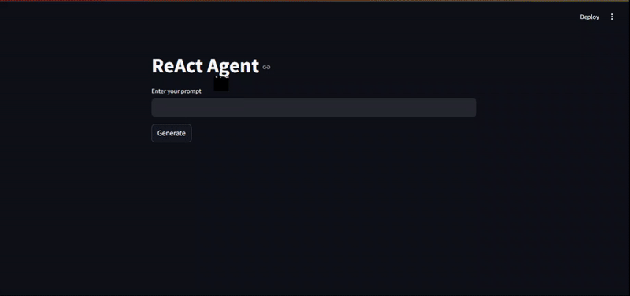

# ReAct Agent Demo

<div align="center">
  
</div>

<p align="center">  
  <b>A demonstration of the ReAct (Reason + Act) paradigm for AI agents.</b>  
</p>

<p align="center">  
  <a href="https://streamlit.io/"></a>  
  <a href="./src/certificate.webp">
    </a>
</p>

---
> ⚠️ **Warning**  
> This project is for **learning purposes only** and is **not production-ready**.  

## 📌 Overview

The **ReAct Agent Demo** provides a hands-on example of how AI agents operate in a cycle of **reasoning, acting, and observing**.

This project is inspired by the Hugging Face **Agent Fundamentals** course and is intended for those interested in understanding **how agents internally work**.

---

## 🧠 The ReAct Paradigm

The agent operates in a continuous loop of:

1. **Think (LLM):** Reason about the current situation and decide the next step.
2. **Act (Tool):** Execute an action, such as calling a tool or function.
3. **Observe (Feedback):** Analyze the result and update reasoning.

This process continues until the agent completes its task.

---

## 🚀 Demo Features

- Step-by-step visualization of the agent’s **thoughts, actions, and observations**.
- Interactive prompt input to experiment with different queries.
- A simple and transparent way to understand AI agent workflows.

---

## ⚡ Getting Started

### 1. Install requirements

```bash
pip install streamlit crewai['tool']
```

### 2. Setup .env File

```bash
OPENAI_API_KEY = "*******"
SERPER_API_KEY = "*******"
```

### 3. Run the app

```bash
streamlit run app.py
```

### 4. Open in browser

Navigate to the URL provided by Streamlit to interact with the demo.

---

## 🙌 Acknowledgements

- Inspired by **AI Agents By Hugging Face🤗**.
- Developed by **Bilal Ahmad**.

---

<p align="center"><i>Explore how agents <b>Think → Act → Observe</b> in real time.</i></p>
<p align="center">
    <a href="https://huggingface.co/learn/agents-course/unit0/introduction">
        
    </a>
</p>


## 📫 Let's Connect  
[](https://linkedin.com/in/bilalahmadai)  [](https://github.com/bilalahmadai)  [](mailto:bilalahmadai.me@gmail.com)

📌 **Let's build AI solutions that drive real impact!**